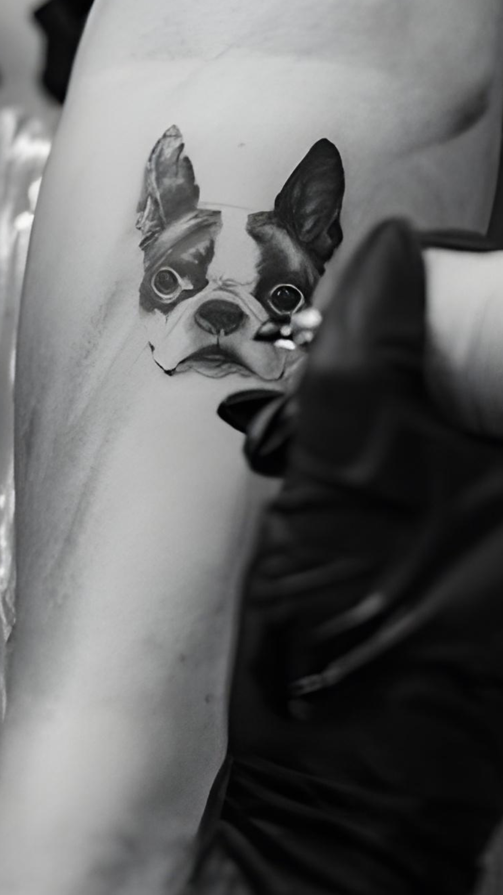

# CLAUDE.md

This file provides guidance to Claude Code (claude.ai/code) when working with code in this repository.

## What this is

Pure static HTML/CSS/JS landing page for Charlotte Tattoo Ink (Charlotte, NC tattoo studio). No build tools, no framework, no package manager. Three pages total.

## Deployment

- **GitHub repo:** `https://github.com/adibjx/cti.git` (branch: `main`)
- **Live URL:** `https://charlottetattooink.com`
- **Hosting:** Vercel free plan — auto-redeploys on every push to `main`

To deploy: `git add <files> && git commit -m "..." && git push`

To preview locally: open any `.html` file directly in a browser, or run any static file server (e.g. `python -m http.server`).

## Pages

| File | Purpose |
|---|---|
| `index.html` | Main landing page — all sections, form, and JS |
| `thank-you.html` | Post-form submission confirmation page |
| `privacy.html` | Privacy Policy |

## Architecture

All CSS is embedded in `<style>` blocks inside each HTML file — there are no external stylesheets. All JS is inline `<script>` at the bottom of each page.

### Design tokens (CSS custom properties, defined in `:root` in each file)

```
--black:   #0D0D0D   (background)
--carbon:  #2B2B2B
--crimson: #E23D28   (accent / CTA)
--bone:    #E8E4DF   (primary text)
--white:   #FAFAFA
--display: Anton, Impact, sans-serif   (headings)
--body:    Quicksand, system-ui        (body text)
--ease:    cubic-bezier(0.22, 0.61, 0.36, 1)
```

Mobile/desktop breakpoint: `720px`.

### Hero image

The hero uses a `<picture>` element (not a CSS background) so the browser can discover and prioritize it early. WebP is served to modern browsers with PNG fallback:

```html
<picture>
    <source media="(min-width: 720px)" type="image/webp" srcset="media/hero/desktop.webp">
    <source media="(min-width: 720px)" srcset="media/hero/desktop.png">
    <source type="image/webp" srcset="media/hero/mobile.webp">
    
</picture>
```

The `` uses `object-fit: cover` — do not revert to `background-image` CSS.

### Form → Google Sheets

The consultation form (`#book` section in `index.html`) POSTs JSON to a Google Apps Script endpoint. Key details:
- `mode: 'no-cors'` is intentional — the Apps Script returns a redirect that CORS would block; the data still reaches the sheet
- On success: fires `window.dataLayer.push({ event: 'form_submission' })` then redirects to `thank-you.html`
- UTM parameters are captured from `window.location.search` and appended to the payload

### Tracking

- **GTM container:** `GTM-WPH44PNC` — snippet in `<head>` + noscript in `<body>` of all three pages
- **GA4:** `G-Z27FYGVZWD` (configured via GTM)
- **Meta Pixel:** `1490716562592398` (configured via GTM)
- GTM listens for the `form_submission` custom event to fire GA4 Lead + Meta Pixel Lead tags

### Google Fonts

Fonts are loaded asynchronously to avoid render-blocking:
```html
<link rel="preload" href="https://fonts.googleapis.com/..." as="style" onload="this.onload=null;this.rel='stylesheet'">
<noscript><link rel="stylesheet" href="..."></noscript>
```
Do not change this back to a regular `<link rel="stylesheet">`.

## Media

```
media/
  hero/         desktop.webp, desktop.png, mobile.webp, mobile.png
  artists/      one image per artist (loren, jasmine, biu, matt, melanie, paul)
  tattoos/      portfolio images grouped by style
  logo-horizontal.png   navbar logo (all pages)
  favicon.png           bee logo
```

## Studio info (use these whenever content changes are needed)

- **Address:** 1819 Sardis Rd N, Suite 320, Charlotte, NC 28270
- **Phone:** (980) 353-6314 · `tel:+19803536314`
- **Email:** appointment@charlottetattooink.com
- **Instagram:** https://www.instagram.com/charlottetattooink/
- **Domain:** charlottetattooink.com

### Artists and their specialties

| Artist | Styles |
|---|---|
| Loren | Micro realism, fine line, floral, pet portrait |
| Jasmine | Anime |
| Biu | New school, color, black & white |
| Matthew | Cartoon |
| Melanie | Chromatic |
| Paul | Black & white realism |
